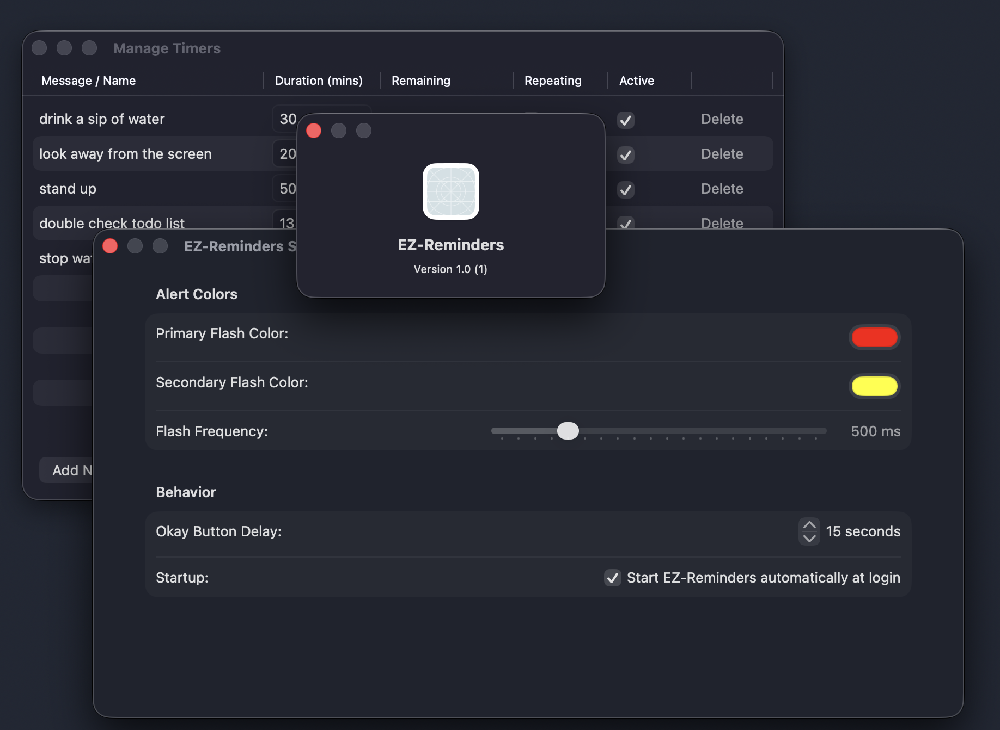
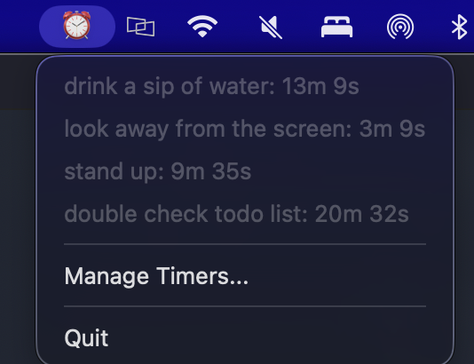
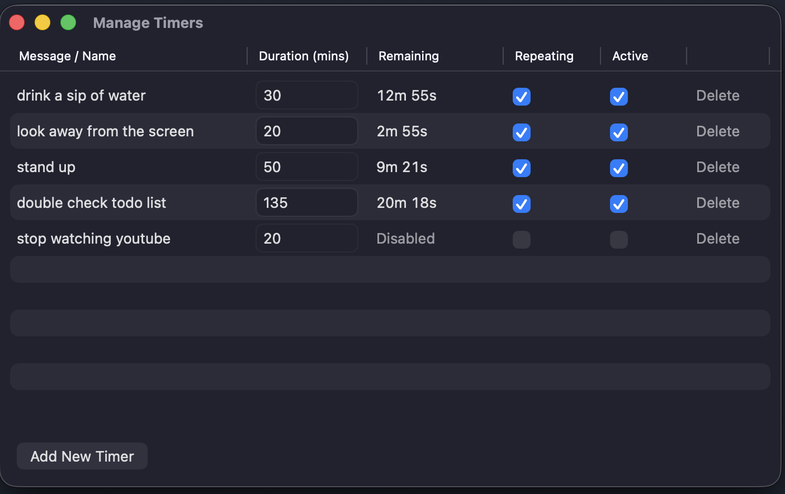
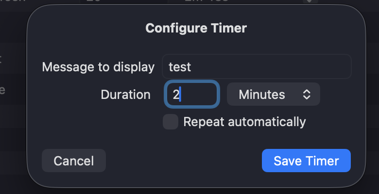
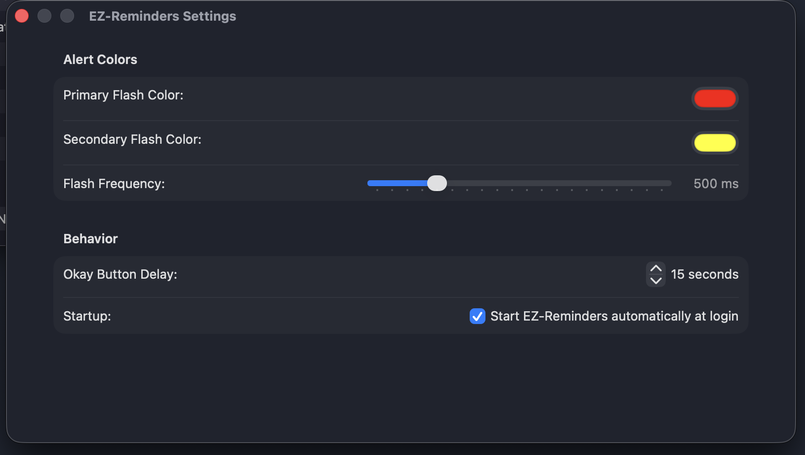

# EZ-Reminders

A lightweight, native macOS menu-bar utility designed to keep you on track. EZ-Reminders allows you to set multiple named timers and recurring reminders that display live countdowns directly in your Mac's menu bar. 

When a timer hits zero, it triggers a highly visible, always-on-top flashing alert to ensure you never miss a reminder. 



## Features
* **Menu-Bar Native:** Runs quietly in the background as an accessory app with live, human-readable countdowns in the drop-down menu.
* **Persistent State:** Timers automatically save to disk and survive app quits or system restarts.
* **Aggressive Alerts:** Custom pop-up windows float above all other applications (even full-screen apps) with a delayed dismissal button to force acknowledgment.
* **Native Settings UI:** Fully customizable alert colors, flash frequencies, and button delays using modern macOS form styling.
* **Launch on Login:** Seamlessly registers to auto-start when you turn on your Mac without requiring root or admin privileges.

## Installation (Quick Start)

If you just want to use the app without messing with code, you can download the pre-compiled version:

1. Navigate to the **Releases** section on the right side of this GitHub page.
2. Download the latest `EZ-Reminders.app.zip` file.
3. Unzip the downloaded file and drag `EZ-Reminders.app` into your Mac's **Applications** folder. 
   > **Note:** The app will not be able to successfully register its auto-start feature if you run it from your Downloads or Desktop folder.
4. **Bypass Gatekeeper:** Because this is an independently signed app, macOS will initially flag it. To open it the first time:
   * Open your Applications folder in Finder.
   * **Right-click** (or Control-click) on `EZ-Reminders.app` and select **Open**.
   * Click **Open** again in the security prompt that appears.

## Usage

### The Menu Bar Interface
Once launched, EZ-Reminders lives completely in your macOS menu bar. Click the ⏰ icon to see a live, human-readable countdown for all your currently active timers.



### Managing Timers
Click **Manage Timers...** from the drop-down to open the main dashboard. Here you can:
* **Inline Edit:** Rename your timers or adjust their duration (in minutes) by typing directly into the table cells.
* **Toggle State:** Quickly pause (disable) active timers or set them to automatically repeat when they hit zero.



* **Add New:** Create precise countdowns by selecting combinations of hours and minutes. 




### Aggressive Alerts
When a timer finishes, EZ-Reminders forces a window above all your other apps. To ensure you actually acknowledge the reminder, the "Okay" button is temporarily disabled while the window flashes.
----
|
----

### Customizing Settings
From the top Apple menu bar, select **EZ-Reminders > Settings...** to tailor the app to your preferences. You can pick custom flashing colors, adjust the animation speed, change the required delay before you can dismiss an alert, and toggle the automatic background startup. 



## Getting Started (For Developers)

To run or modify this project on your own macOS machine:

1. **Clone the repository:** 
   ```bash
   git clone [https://github.com/yourusername/ez-reminders.git](https://github.com/yourusername/ez-reminders.git)